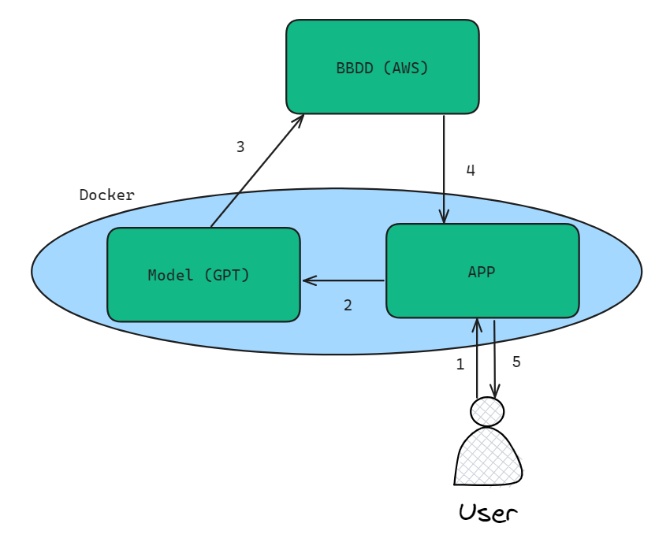

# DE_project

### Welcome to our Chat GPT Assistant.  We use a web application in Python which communicates with ChatGPT to answer user questions, retrieve information from the language model, and store the question, results and date in a database using AWS.

<div style="position: relative;">
  
  <div style="position: absolute; top: 75%; left: 50%; transform: translate(-50%, -50%); text-align: center;">
    <h2 style="color: white; font-size: 32px; background-color: rgba(0, 0, 0, 0.7); padding: 10px;">Chat GPT Assistant</h2>
  </div>
</div>


## Features

- Utilizes the OpenAI GPT API to generate responses based on user queries.
- Minimalistic front-end interface for easy user interaction.
- Stores questions, answers, and corresponding dates in a cloud-based database (AWS).
- Dockerized for simple deployment and scalability.

## Prerequisites

- Python 3.11
- Docker

## Please use the following instructions in order to use the APP correctly:

- Create an Open AI account and record the key  [OpenAI](https://auth0.openai.com/u/signup/identifier?state=hKFo2SA0Z241MzBGOVd5SHo4MHAzM0FOUkZkbG11OVhmT2YwRqFur3VuaXZlcnNhbC1sb2dpbqN0aWTZIDEwNW9SRG14UHhlMnB1b0k1RjFVcUQ2TlhhN0dfXzZWo2NpZNkgRFJpdnNubTJNdTQyVDNLT3BxZHR3QjNOWXZpSFl6d0Q)

- Create an SerpApi account and record the key  [SerpApi](https://serpapi.com/users/sign_up)

- Create an AWS account and create an RDS, also record the key  [AWS](https://portal.aws.amazon.com/billing/signup?nc2=h_ct&src=header_signup&redirect_url=https%3A%2F%2Faws.amazon.com%2Fregistration-confirmation&language=es_es#/start/email)

- Create a .env file and input the information from the accounts created above into the fields specified below.

```python
OPENAI_API_KEY='XXXXX'
SERPAPI_API_KEY='XXXXX'
USER_DB_AWS='XXXXX'
PASSWORD_DB_AWS='XXXXX'
HOST_DB_AWS='XXXXX'
```


## When executing code, be sure to execute db_create.py first, before launching the app.py. 

## To create docker file:
```docker
docker build -t de_project . 

docker run -p 5000:5000 de_project
```

##  The project follows the following architecture:



## Project Team:
- Jaime Puchol
- Juan Mendizabal
- Alfredo Ruiz
- Blanca Marmolejo


